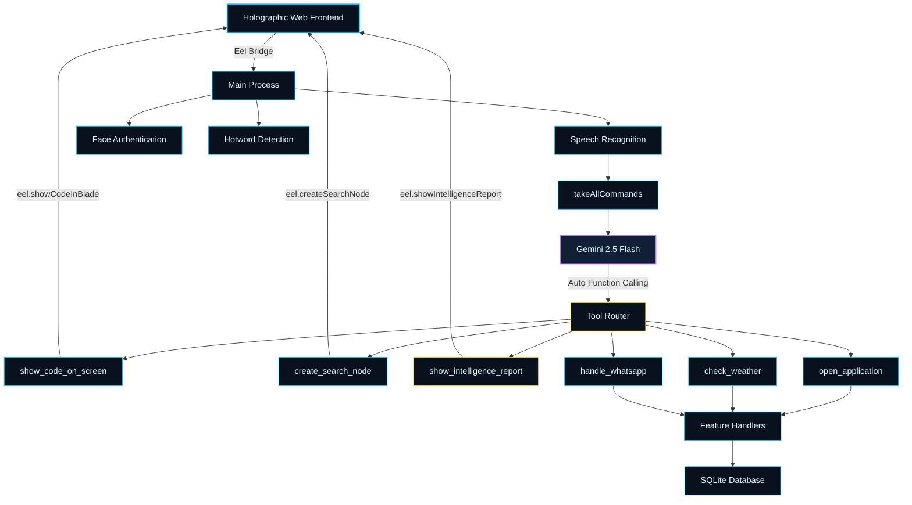

<div align="center">

# JRAVIST — Holographic AI Core

### *Advanced Voice-Controlled AI Operating System*

[](https://www.python.org/downloads/)
[](https://opensource.org/licenses/MIT)
[](http://makeapullrequest.com)
[](https://github.com/ZOMA827/jravist/stargazers)
[](https://github.com/ZOMA827/jravist/network)
[](https://github.com/ZOMA827/jravist/graphs/contributors)
[](https://github.com/ZOMA827/jravist/actions/workflows/codeql-analysis.yml)

[](https://lakhdari-workspace.web.app/)
[](https://linkedin.com/in/lakhdari-ilyes-6359b8351)


*A production-ready holographic AI assistant powered by Google Gemini 2.5 Flash, with automatic function calling, a spatial holographic UI, and biometric authentication.*

[Features](#features) • [Installation](#installation) • [API Keys](#api-keys--required) • [Usage](#usage) • [Documentation](#development) • [Contributing](#contributing)

---


</div>

## Overview

JRAVIST is an intelligent holographic AI assistant that combines speech recognition, Gemini-powered natural language processing, automatic function calling, and computer vision to deliver a cinematic, spatial computing experience. The system features biometric authentication, a deep-space holographic UI with orbital rings and floating information nodes, and a direct bridge between voice commands and system actions — all powered by your own Google Gemini API keys.

> **⚠️ Important:** JRAVIST requires your own API keys to function. The system does **not** include any pre-configured credentials. See the [API Keys](#api-keys--required) section below before running the project.

<div align="center">

## Key Features

| Holographic UI | Gemini AI Core | Face Recognition | Voice Control |
|:---:|:---:|:---:|:---:|
| Spatial floating nodes & blades | Gemini 2.5 Flash + Auto Function Calling | Secure biometric auth | Always-on wake word |

</div>

### Core Capabilities

<table>
<tr>
<td width="50%">

**Voice & AI**
- Real-time Speech Recognition using Google STT
- **Google Gemini 2.5 Flash** as the AI brain (replaces HugChat)
- **Automatic Function Calling** — Gemini decides which tool to invoke
- **Multi-key rotation system** — automatically switches API keys on quota exhaustion
- Text-to-Speech with customizable voices
- Audio Visualization in real-time
- Wake Word Detection ("Jarvis", "Alexa")

</td>
<td width="50%">

**Holographic Interface (New)**
- **Information Blade** — slides in for code & intelligence reports
- **Floating Search Nodes** — draggable glassmorphic result windows
- **Kinetic Core** — orbital rings that change color per AI mode
- **Live Mode Indicator** — STANDBY / LISTENING / THINKING / SEARCHING / VISION
- Deep Space & Neon color palette (cyan `#00c8ff`, amber `#ffc800`, pink `#ff3c78`)

</td>
</tr>
<tr>
<td width="50%">

**Smart Integrations**
- WhatsApp Automation (messages, calls, video)
- YouTube Control via voice commands
- System Control (apps, windows, shortcuts)
- Contact Management with voice lookup
- Web Browsing through voice
- Weather Forecasts via OpenWeatherMap API

</td>
<td width="50%">

**Holographic AI Tools (New)**
- `show_code_on_screen` — renders code in the Code Blade with syntax highlighting
- `create_search_node` — spawns a floating info node on the UI
- `show_intelligence_report` — opens the full Report Blade for long-form content
- `change_interface_mode` — switches the UI color theme dynamically
- `show_system_notification` — fires a HUD toast alert

</td>
</tr>
</table>

---

<div align="center">

## Technology Stack

### Backend Technologies


### Frontend Technologies


### AI & ML


### Tools & Libraries


</div>

---

<div align="center">

## System Architecture



</div>

---

## Prerequisites

<table>
<tr>
<td width="50%">

### System Requirements
```yaml
OS: Windows 10/11, Linux, macOS
Python: 3.10+
RAM: 4GB minimum
Storage: 500MB free space
```

</td>
<td width="50%">

### Hardware
```yaml
Microphone: Required for voice input
Webcam: Required for face recognition
Internet: Active connection needed
Audio Output: Speakers/Headphones
```

</td>
</tr>
</table>

---

## API Keys — Required

> **JRAVIST will not start without valid API keys.** The project ships with no pre-configured credentials. You must obtain your own keys and configure them before running.

### 1. Google Gemini API Keys (Core AI — Required)

Gemini is the brain of JRAVIST. You need **at least one key**, but adding multiple keys enables the automatic rotation system that prevents quota interruptions.

1. Go to [Google AI Studio](https://aistudio.google.com/app/apikey)
2. Sign in with your Google account
3. Click **"Create API Key"**
4. Copy the key (starts with `AIza...`)
5. Open `backend/command.py` and add your keys to the list:

```python
GEMINI_API_KEYS = [
    "AIzaSy_YOUR_FIRST_KEY_HERE",
    "AIzaSy_YOUR_SECOND_KEY_HERE",   # optional but recommended
    "AIzaSy_YOUR_THIRD_KEY_HERE",    # optional
]
```

> **Tip:** Gemini's free tier gives 1,500 requests/day per key. Adding 2–3 keys means JRAVIST can handle much heavier use before hitting limits.

---

### 2. OpenWeatherMap API Key (Weather — Required for weather commands)

1. Sign up for free at [openweathermap.org](https://openweathermap.org/api)
2. Navigate to **My API Keys** and copy your key
3. Add it to your `.env` file:

```env
OPENWEATHERMAP_API_KEY=your_openweathermap_key_here
```

---

### 3. Picovoice Porcupine Key (Wake Word — Required for hotword detection)

1. Sign up at [picovoice.ai](https://console.picovoice.ai/)
2. Create a new project and copy your **AccessKey**
3. Add it to your `.env` file:

```env
PORCUPINE_ACCESS_KEY=your_porcupine_key_here
```

---

### 4. Full `.env` Template

Create a `.env` file in the project root with all your keys:

```env
# ── Gemini keys are configured directly in backend/command.py ──

# Wake Word Detection
PORCUPINE_ACCESS_KEY=your_porcupine_key_here

# Weather
OPENWEATHERMAP_API_KEY=your_openweathermap_key_here

# Voice Settings
TTS_RATE=150
TTS_VOICE=0

# Recognition Settings
FACE_CONFIDENCE_THRESHOLD=50
HOTWORD_SENSITIVITY=0.5
```

> **Note:** Gemini API keys go directly into `GEMINI_API_KEYS` list in `backend/command.py`, not in the `.env` file. This allows the multi-key rotation system to work correctly.

---

## Installation

### Step 1: Clone Repository

```bash
git clone https://github.com/ZOMA827/jravist.git
cd jravist
```

### Step 2: Setup Virtual Environment

<table>
<tr>
<td width="50%">

**Windows**
```bash
python -m venv venv
venv\Scripts\activate
```

</td>
<td width="50%">

**Linux/Mac**
```bash
python3 -m venv venv
source venv/bin/activate
```

</td>
</tr>
</table>

### Step 3: Install Dependencies

```bash
pip install -r requirements.txt
```

> **Note:** `google-generativeai` is now a required dependency (replaces `hugchat`). Make sure your Python environment has internet access during install.

### Step 4: Configure Your API Keys

Follow the [API Keys](#api-keys--required) section above to add your Gemini keys to `backend/command.py` and create your `.env` file.

### Step 5: Train Face Recognition (Optional)

```bash
python backend/auth/trainer.py
```

<div align="center">

### Quick Start

```bash
python run.py
```

**JRAVIST will launch at** `http://localhost:8000`

</div>

---

## Usage

### Voice Commands

<table>
<tr>
<td width="33%">

#### System Control
```
Jarvis, open Chrome
Jarvis, launch VS Code
Jarvis, close window
Jarvis, shutdown computer
```

</td>
<td width="33%">

#### Media Control
```
Jarvis, play Metallica
Jarvis, pause video
Jarvis, next song
Jarvis, volume up
```

</td>
<td width="33%">

#### Communication
```
Jarvis, message John
Jarvis, call Sarah
Jarvis, video call Mike
Jarvis, open WhatsApp
```

</td>
</tr>
<tr>
<td width="33%">

#### Weather & Information
```
Jarvis, weather in London
Jarvis, forecast for Tokyo
Jarvis, weather in New York
Jarvis, forecast Paris
```

</td>
<td width="33%">

#### AI & Code (New)
```
Jarvis, write a Python script
Jarvis, explain how TCP works
Jarvis, search for quantum computing
Jarvis, give me a report on AI
```

</td>
<td width="33%">

#### Interface Control (New)
```
Jarvis, switch to search mode
Jarvis, switch to vision mode
Jarvis, switch to idle mode
```

</td>
</tr>
</table>

### How Gemini Function Calling Works

When you give JRAVIST a command, it goes directly to **Gemini 2.5 Flash**. Gemini reads the command and automatically decides which tool to call — no manual `if/elif` parsing needed:

| You say | Gemini calls |
|:--------|:-------------|
| "Write me a Python class for a linked list" | `show_code_on_screen(code)` → opens Code Blade |
| "What is quantum entanglement?" | `create_search_node(title, summary)` → spawns floating node |
| "Give me a full report on climate change" | `show_intelligence_report(title, content)` → opens Report Blade |
| "Open Chrome" | `open_application("Chrome")` |
| "Switch to search mode" | `change_interface_mode("search")` → UI turns amber |

### Holographic Interface Elements

| Element | How to trigger |
|:--------|:--------------|
| **Code Blade** | Ask Gemini to write any code |
| **Report Blade** | Ask for a full report or analysis |
| **Search Nodes** | Ask for a quick fact or definition |
| **Mode change** | Say "switch to [mode] mode" or Gemini decides |
| **Mic / Voice** | Click mic button or press `⌘J` |
| **Interaction Log** | Click the chat icon in the input bar |

### Keyboard Shortcuts

<div align="center">

| Shortcut | Action |
|:--------:|:------:|
| `Win + J` (Windows) | Manual Voice Activation |
| `Cmd + J` (macOS) | Manual Voice Activation |
| `Ctrl + Q` | Quit Application |
| `F11` | Fullscreen Toggle |

</div>

### Wake Words

Say **"Jarvis"** or **"Alexa"** followed by your command

---

## Weather Feature

JRAVIST integrates with OpenWeatherMap API to provide real-time weather updates and forecasts via Gemini's automatic function calling.

### Setup OpenWeatherMap API

1. Sign up for a free API key at [OpenWeatherMap](https://openweathermap.org/api)
2. Add your API key to the `.env` file:
   ```env
   OPENWEATHERMAP_API_KEY=your_api_key_here
   ```

### Weather Commands

**Current Weather:**
```bash
Jarvis, weather in London
Jarvis, what's the weather in Tokyo
Jarvis, weather for New York
```

**Weather Forecast (3-5 days):**
```bash
Jarvis, forecast for Paris
Jarvis, forecast in Mumbai
Jarvis, weather forecast for Berlin
```

### Features

- ✅ Current temperature, feels-like temperature, and conditions
- ✅ Humidity, wind speed, and atmospheric pressure
- ✅ 3-5 day weather forecast with daily min/max temperatures
- ✅ Graceful handling of invalid city names
- ✅ Clean console output with detailed information
- ✅ Voice responses for hands-free operation

### Standalone Usage

You can also use the weather module independently:

```bash
python weather_fetcher.py
```

Then use commands like:
- `weather London` - Get current weather
- `forecast Tokyo` - Get 5-day forecast
- `exit` - Quit the application

### Testing

Run the weather module tests:

```bash
python -m testing.weather_test
```

---

## Project Structure

```
jravist/
├── backend/
│   ├── auth/
│   │   ├── haarcascade_frontalface_default.xml
│   │   ├── recognize.py        # Face recognition
│   │   ├── trainer.py          # Model training
│   │   └── trainer/            # Trained models
│   ├── command.py              # Gemini core + tool definitions + key rotation
│   ├── config.py               # Configuration
│   ├── db.py                   # Database ops
│   ├── feature.py              # Feature handlers (open apps, weather, WhatsApp…)
│   └── helper.py               # Utilities
├── frontend/
│   ├── assets/
│   │   ├── audio/              # Sound files
│   │   ├── img/                # Images & icons
│   │   └── vendor/             # Third-party libs (textillate, etc.)
│   ├── index.html              # Holographic UI shell
│   ├── style.css               # Deep Space & Neon styles
│   ├── script.js               # Particle sphere (Kinetic Core canvas)
│   ├── main.js                 # UI logic, blade panels, search nodes, mode manager
│   └── controller.js           # eel.expose() bindings (Python ↔ JS bridge)
├── main.py                     # Entry point
├── run.py                      # Launcher
├── weather_fetcher.py          # Weather module
├── requirements.txt            # Dependencies
├── testing/
│   ├── weather_test.py         # Weather tests
│   └── text_test.py            # Command parser tests
└── jarvis.db                   # SQLite DB
```

---

## Development

### Adding a New Holographic Tool

JRAVIST uses Gemini's **automatic function calling**. To add a new tool that Gemini can invoke:

**1. Define the tool function in `backend/command.py`**

```python
def my_new_tool(param1: str, param2: int = 5):
    """
    Describe clearly what this tool does so Gemini knows when to call it.
    Be specific — Gemini reads this docstring to decide when to use the tool.
    """
    # your logic here
    eel.myFrontendFunction(param1, param2)  # optional: update the UI
    return f"Tool completed for {param1}"
```

**2. Register it in the `all_tools` list inside `init_gemini_chat()`**

```python
all_tools = [
    open_application,
    play_on_youtube,
    # ...existing tools...
    my_new_tool,     # <-- add here
]
```

**3. If it needs a frontend action, add the matching `eel.expose()` in `controller.js`**

```javascript
eel.expose(myFrontendFunction);
function myFrontendFunction(param1, param2) {
    // update the holographic UI
}
```

Gemini will now automatically call your tool whenever it decides it fits the user's request — no manual parsing required.

---

### Adding Classic Commands (feature.py)

For system-level actions that don't need AI judgment, add them to `backend/feature.py` and expose them as a tool:

**1. Implement in `feature.py`:**

```python
def handle_custom_action(params: dict) -> str:
    result = do_something(params)
    return f"Action completed: {result}"
```

**2. Wrap as a tool in `command.py`:**

```python
def my_action_tool(action_target: str):
    """Use this tool when the user asks to perform [specific action]."""
    from backend.feature import handle_custom_action
    handle_custom_action({"target": action_target})
    return f"Done: {action_target}"
```

---

### Database Schema

```sql
-- Contacts Table
CREATE TABLE contacts (
    id INTEGER PRIMARY KEY AUTOINCREMENT,
    name TEXT NOT NULL,
    phone TEXT,
    whatsapp TEXT,
    email TEXT,
    created_at TIMESTAMP DEFAULT CURRENT_TIMESTAMP
);

-- Applications Table
CREATE TABLE apps (
    id INTEGER PRIMARY KEY AUTOINCREMENT,
    name TEXT NOT NULL,
    path TEXT NOT NULL,
    keywords TEXT,
    icon TEXT,
    created_at TIMESTAMP DEFAULT CURRENT_TIMESTAMP
);

-- Web Commands Table
CREATE TABLE web_commands (
    id INTEGER PRIMARY KEY AUTOINCREMENT,
    command TEXT NOT NULL,
    url TEXT NOT NULL,
    description TEXT,
    created_at TIMESTAMP DEFAULT CURRENT_TIMESTAMP
);
```

### Testing

```bash
# Run all tests
pytest tests/ -v

# Run with coverage
pytest --cov=backend --cov-report=html tests/

# Run specific test file
pytest tests/test_command.py -v

# Linting
black backend/ frontend/ --check
flake8 backend/
pylint backend/
```

### Docker Deployment

```dockerfile
FROM python:3.10-slim

WORKDIR /app

# Install system dependencies
RUN apt-get update && apt-get install -y \
    portaudio19-dev \
    python3-pyaudio \
    libopencv-dev \
    && rm -rf /var/lib/apt/lists/*

# Copy and install Python dependencies
COPY requirements.txt .
RUN pip install --no-cache-dir -r requirements.txt

# Copy application
COPY . .

EXPOSE 8000

CMD ["python", "run.py"]
```

**Build & Run:**
```bash
docker build -t jravist-ai .
docker run -p 8000:8000 -v $(pwd)/jarvis.db:/app/jarvis.db jravist-ai
```

---

<div align="center">

## Performance Metrics

| Metric | Value | Status |
|:------:|:-----:|:------:|
| Cold Start Time | ~3.5s |  |
| Response Latency | <200ms |  |
| Face Recognition Accuracy | 94.2% |  |
| Memory Footprint | ~150MB |  |
| CPU Usage (Idle) | 2-5% |  |

*Benchmarked on Windows 11, Intel i5-10400, 16GB RAM*

</div>

---

## Troubleshooting

### Gemini API Key Issues

**"All keys exhausted their daily quota"**
- Add more keys to the `GEMINI_API_KEYS` list in `backend/command.py`
- Free tier: 1,500 requests/day per key — 3 keys = ~4,500 requests/day

**"API key not valid"**
- Make sure the key starts with `AIza`
- Regenerate at [Google AI Studio](https://aistudio.google.com/app/apikey)

**Function calling not triggering UI tools**
- Check that `eel.showCodeInBlade`, `eel.createSearchNode`, and `eel.showIntelligenceReport` are exposed in `controller.js`
- Make sure Gemini's tool docstrings are clear and specific

---

### PyAudio Installation Fails

**Windows:**
```bash
pip install pipwin
pipwin install pyaudio
```

**Linux:**
```bash
sudo apt-get install portaudio19-dev python3-pyaudio
pip install pyaudio
```

**macOS:**
```bash
brew install portaudio
pip install pyaudio
```

### Face Recognition Not Working

1. Ensure good lighting conditions
2. Position face 2-3 feet from camera
3. Retrain model:
   ```bash
   python backend/auth/trainer.py
   ```
4. Check camera permissions in system settings

### Voice Commands Unresponsive

1. Check microphone permissions
2. Test microphone:
   ```bash
   python -m speech_recognition
   ```
3. Verify internet connection (required for Google STT and Gemini)
4. Try different microphone device

### Module Import Errors

```bash
pip install --upgrade --force-reinstall -r requirements.txt
```

### Enable Debug Mode

```bash
# Windows
set JARVIS_DEBUG=1
python run.py

# Linux/Mac
export JARVIS_DEBUG=1
python run.py
```

---

<div align="center">

## Contributing

**We welcome contributions from the community**

</div>

### Contribution Guidelines

1. Fork the repository
2. Create a feature branch (`git checkout -b feature/amazing-feature`)
3. Commit your changes (`git commit -m 'feat: add amazing feature'`)
4. Push to the branch (`git push origin feature/amazing-feature`)
5. Open a Pull Request

### Commit Convention

```
type(scope): subject

[optional body]

[optional footer]
```

**Types:** `feat`, `fix`, `docs`, `style`, `refactor`, `test`, `chore`

**Example:**
```bash
git commit -m "feat(tools): add new holographic tool for calendar"
git commit -m "fix(gemini): improve key rotation on quota error"
git commit -m "docs(readme): update API key setup instructions"
```

### Code Style

- Follow PEP 8 for Python code
- Use type hints where applicable
- Write docstrings for public functions — Gemini reads them for tool selection
- Run `black` and `flake8` before committing
- Add unit tests for new features

<div align="center">

### Top Contributors

<a href="https://github.com/ZOMA827/jravist/graphs/contributors">
  
</a>

</div>

---

## Roadmap

<table>
<tr>
<td width="33%">

### Short Term
- [ ] Multi-language support
- [ ] Mobile companion app
- [ ] Theme customization
- [ ] Plugin system

</td>
<td width="33%">

### Medium Term
- [ ] Cloud synchronization
- [ ] Home automation
- [ ] Voice training
- [ ] Analytics dashboard

</td>
<td width="33%">

### Long Term
- [ ] Advanced AI models
- [ ] Cross-platform support
- [ ] Multi-user profiles
- [ ] End-to-end encryption

</td>
</tr>
</table>

---

<div align="center">

## About the Developer

</div>

<table>
<tr>
<td>

**Ilyes Lakhdari** (إلياس لخداري) is a 3rd-year Computer Science student at Batna 2 University (Fesdis). Passionate about building intelligent, full-stack ecosystems and local AI tools. Creator of advanced projects like **Bimo AI**, **CareerCraft**, and the **Healthmate ecosystem**.

[](https://lakhdari-workspace.web.app/)
[](https://linkedin.com/in/lakhdari-ilyes-6359b8351)
[](https://github.com/ZOMA827)

</td>
</tr>
</table>

---

<div align="center">

## License

This project is licensed under the **MIT License**

[](https://opensource.org/licenses/MIT)

See [LICENSE](LICENSE) file for details

</div>

---

<div align="center">

## Acknowledgments

Special thanks to these amazing projects:

[](https://opencv.org/)
[](https://ai.google.dev/)
[](https://getbootstrap.com/)
[](https://fonts.google.com/specimen/Rajdhani)

</div>

---

<div align="center">

## Support

**Project Link:** [github.com/ZOMA827/jravist](https://github.com/ZOMA827/jravist)

For issues, questions, or feature requests, please open an issue on GitHub

---

### Show Your Support

If you find this project helpful, please consider starring the repository

[](https://star-history.com/#ZOMA827/jravist&Date)

**Made with Python & Google Gemini**


**Copyright © 2026 — Ilyes Lakhdari**

</div>
